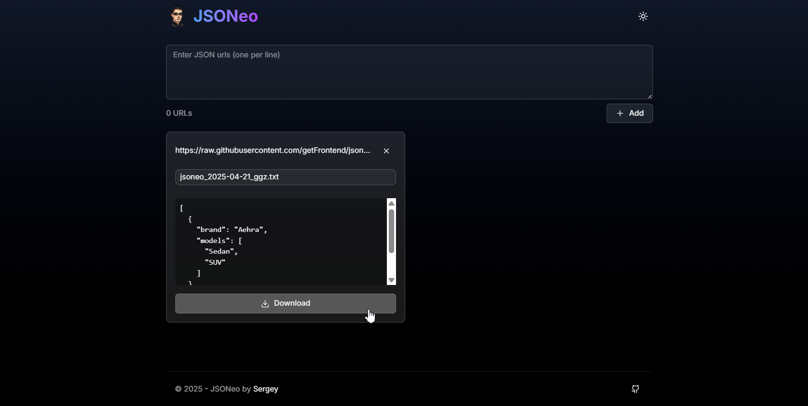

# About
JSONeo is a modern web application that allows you to easily download and format JSON data from multiple URLs. Built with Next.js and styled with Tailwind CSS, it provides a sleek and user-friendly interface for working with JSON files.

## Features

- 🚀 Download JSON data from multiple URLs simultaneously
- 💅 Automatic JSON formatting and prettification
- 📋 Multi-URL input support with validation
- 🌓 Light/Dark theme toggle
- 🎨 Modern glass-morphism UI design
- ⚡ Real-time preview of JSON content
- 📱 Responsive layout for all devices
- 🔍 Error handling and validation

## Tech Stack

- [Next.js 15](https://nextjs.org/) - React Framework
- [Tailwind CSS](https://tailwindcss.com/) - Styling
- [Framer Motion](https://www.framer.com/motion/) - Animations
- [TypeScript](https://www.typescriptlang.org/) - Type Safety
- [Lucide Icons](https://lucide.dev/) - Icons

## Usage

1. Enter one or multiple JSON URLs in the input field (one per line)
2. Click "Add" to fetch and format the JSON data
3. Preview the formatted JSON content
4. Customize the filename if needed
5. Click "Download" to save the formatted JSON file

